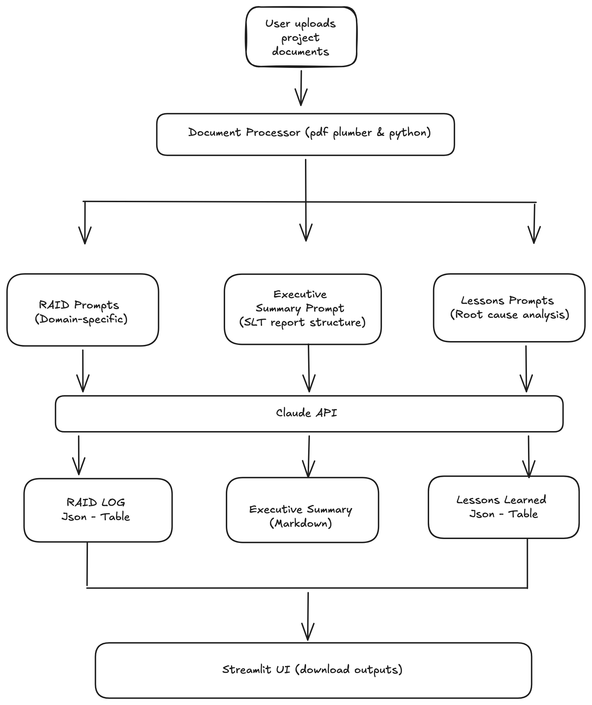

# AI Governance Assist

AI-powered Programme Governance Assistant that converts project updates and meeting notes into governance artefacts such as RAID logs, executive summaries, board reports, and lessons learned.

I have created an AI-powered tool that analyses project documentation and generates useful structured governance outputs: RAID logs, executive summaries and lessons learnt documents that support project, programme and further portfolio decision-making.

## Live Demo

[Link to deployed app](https://ai-governance-assist.streamlit.app/)

## The Problem

Throughout my years within project management, I noticed that Project, Risk and Programme  managers would spend hours manually producing RAID logs, executive summaries and lessons learnt reports from project documentation to evaluate both Project and programme scope, performance and output. These activities are repetitive and often require synthesising information from multiple project updates. During my experience in UKHSA, I worked with the Risk Manager to weekly track the RAID Log and manually update new information given through team or 1-1 meetings and worked with the chief consultant to execute the end of programme lessons learnt workshops through multiple interviews.

## The Solution

AI Governance Assist uses a LLM to analyse uploaded project documentation and generate RAID Logs, Executive summaries and Lessons Learnt reports.
application provides a simple web interface where users can upload project artefacts and to create structured governance outputs fast.
This tool reduces administrative overhead and saves time by automating governance reporting using generative AI; ensuring faster reporting updates while maintaining robust, structured and professional output that senior leadership teams expect.

## Features

- Upload project documents
- AI-generated RAID logs
- Executive summary generation
- Board reporting support
- Lessons learned analysis
- Downloadable outputs
- Cloud-deployable architecture

## How It Works

1. Upload a project document (PDF or DOCX)
2. Select Governance Agent (Governance Agent for RAID Logs, Executive Agent for summaries or Lessons Learned Agent to identify successes, challenges and recommendations)
3. AI Government Assist analyses the document using domain-specific prompt engineering then extracts and processes the document text
4. Output is generated within seconds: RAID Log, Executive Summary or Lessons Learnt 
5. Use Export report to download structured output for stakeholder review


## Architecture

- **Frontend**: Streamlit with custom styling
- **LLM**: Anthropic Claude (claude-sonnet-4-6) with structured JSON output
- **Document Processing**: pdfplumber (PDF), python-docx (DOCX)
- **Deployment**: Streamlit Community Cloud

## Design Decisions

- **Domain-specific prompts over generic ones**: The prompts contain real programme governance knowledge, distinguishing between risks and issues, flagging cross-organisational dependencies, structuring summaries for SLT audiences and gathering data for lessons learnt reporting.
- **Structured JSON output for RAID**: Ensures consistent, parseable output that can be exported and used for governance tools.
- **Low temperature (0.2)**: Prioritises factual extraction over creative generation to reduce hallucination when analysing documents.
- **Text limit**: Documents over 6,000 words are cut short to maintain output quality within the LLM context window. This was done intentionally to stabilize API costs.

## Challenges

Challenge 1: Implementing output formatting requirements for context management. I introduced preprocessing and summarisation before analysis after reviewing various documents. This helped me to set guardrails to avoid generated documents of useless mass data

Challenge 2: Maintaining output consistency through prompt engineering techniques. I created the specific agent workflows for each governance output type, I had to ensure that the prompts used were aligned and detailed to create the desired output suitable for professional use. Live working documentation will be the real acid test to confirm that current prompts are correct enough for the generated document to be valuable.

## Future Improvements

- Include RAG with vector search for large document sets - This would be for enterprise level companies that process multiple large documents, enabling individuals to upload an entire programme's worth of paperwork and generate a RAID log, exec summary or lessons learnt report across all of it. 
- Multi-document comparison (compare RAID logs across programme phases) This would be incredibly useful in reporting to portfolio level board meetings to oversee performance for executive decision making
- Export to DOCX/XLSX format for easy use in governance report packs
- User authentication and report history for data protection or safeguarding compliance
- Batch processing for multiple documents

## Local Setup Installation

1. Clone the repo:
   ```bash
   git clone https://github.com/DemiA25/ai-governance-assistant.git
   cd ai-governance-assistant
   ```

2. Install dependencies:
   ```bash
   pip install -r requirements.txt
   ```

3. Run the app:
   ```bash
   streamlit run app.py
   ```

## What I Learnt 

Through this project I developed experience in:

- Prompt engineering
- Building AI-powered applications
- Python and LLM application development
- API integration
- Rapid prototyping and deployment
This project gave me practical experience building an end-to-end AI application, from designing the user workflow to integrating Claude APIs and deploying a working solution. I learned how prompt design directly impacts output quality, how to structure AI-powered workflows for specific business tasks, and how to translate a real-world operational problem into a usable software product; reinforcing the opportunities available to solve genuine business problems with technical ability and implementation.

## Tech Stack

| Component | Technology |
|-----------|-----------|
| Language | Python 3.11+ |
| UI Framework | Streamlit |
| LLM Provider | Anthropic Claude API |
| PDF Processing | pdfplumber |
| DOCX Processing | python-docx |
| Data Display | pandas |
| Deployment | Streamlit Community Cloud |
